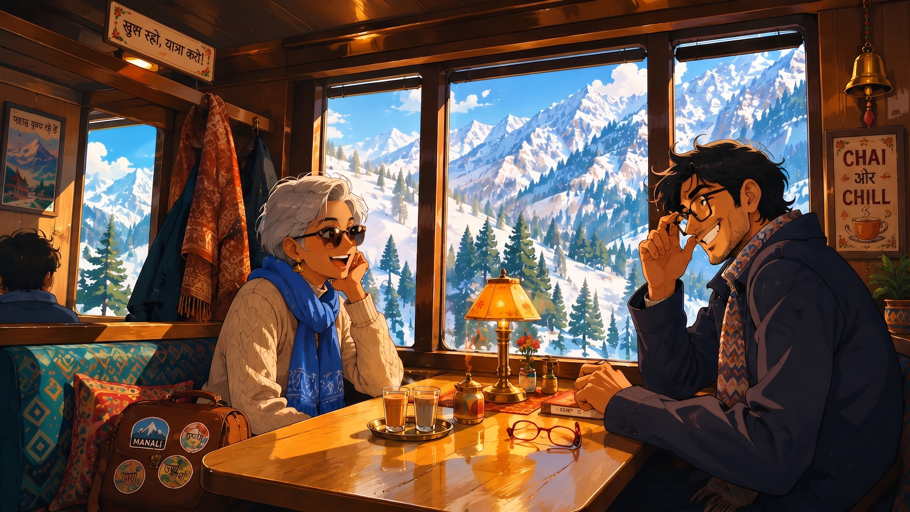
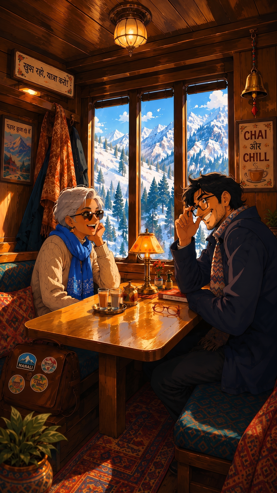
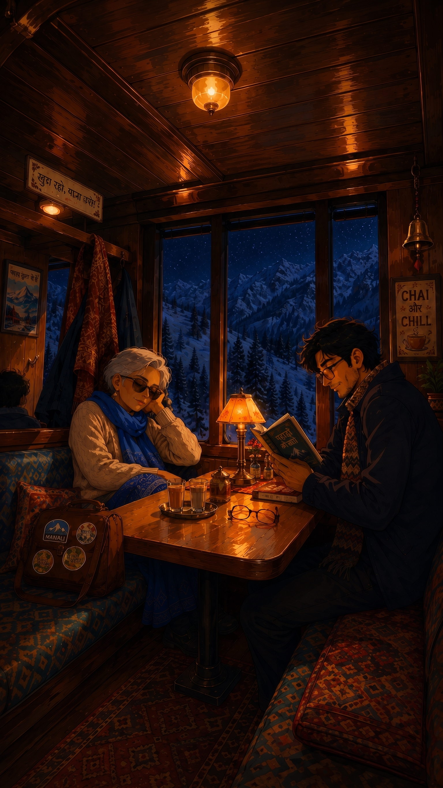

# Dholna

*A train window, a changing sky, and a handful of songs for disappearing into your own thoughts for a while.*

**[View Dholna ↗](https://ameersameerkhan.github.io/dholna/)**



Dholna is a small experiment in music, motion and nostalgia. Switch between day and night, press play, and let the journey run.

<table>
  <tr>
    <td></td>
    <td></td>
  </tr>
  <tr>
    <td align="center"><strong>Day</strong></td>
    <td align="center"><strong>Night</strong></td>
  </tr>
</table>

## Run it locally

You need Node.js 22.13+ and npm.

```bash
git clone https://github.com/ameersameerkhan/dholna.git
cd dholna
npm ci
npm run dev
```

Open the local URL printed by Vite.

For a production check:

```bash
npm test
npm run build
npm run smoke
```

The Playwright smoke suite installs Chromium separately, so on a new machine run `npx playwright install chromium` before `npm run smoke` if needed.

## Make it yours

Dholna is deliberately small. Most remixes only need a few files.

### 1. Replace the journey

Swap the four files in `public/scenes/` while keeping the filenames:

```text
public/scenes/day.jpg
public/scenes/day-mobile.jpg
public/scenes/night.jpg
public/scenes/night-mobile.jpg
```

Use paired day/night compositions with the same framing so the transition feels like one journey changing around you. See `public/scenes/README.md` for the lightweight artwork guide.

### 2. Choose the music

Edit the two YouTube video ID arrays in:

```text
src/config/tracks.ts
```

Dholna uses the YouTube IFrame Player API. It does not bundle audio files.

A small reserve list lives in `tools/track-reserves.ts` for maintainers. To verify that configured videos are still embeddable:

```bash
npm run verify:runtime-tracks
npm run verify:tracks
```

### 3. Change the words and signature

The About copy and quiet GitHub link live in `src/about/AboutJourneyModal.tsx`.

The maker signature lives in `src/chrome/AttributionLink.tsx`.

### 4. Deploy it

The included GitHub Pages workflow builds and deploys `main` automatically.

If your repository is not named `dholna`, update the production `base` path in `vite.config.ts` before deploying. Then enable GitHub Pages with **GitHub Actions** as the source in your repository settings.

## Useful commands

| Command | What it does |
| --- | --- |
| `npm run dev` | Start the Vite development server |
| `npm test` | Run the Vitest suite |
| `npm run build` | Type-check and build the production app |
| `npm run smoke` | Run local Playwright browser smoke tests |
| `npm run smoke:live` | Run the smoke suite against the configured live site |
| `npm run verify:runtime-tracks` | Check the active YouTube tracks |
| `npm run verify:tracks` | Check active and reserve YouTube tracks |

## Maintainer tools

Two small browser utilities live under `tools/` and are intentionally excluded from the production site.

Run `npm run dev`, then open:

```text
http://localhost:5173/tools/track-curator.html
http://localhost:5173/tools/track-verifier.html?videoId=VIDEO_ID
```

The curator is an index of active and reserve IDs. The verifier exposes low-level YouTube playback diagnostics used by the Playwright verification suite.

## Architecture

Dholna is React + TypeScript built with Vite, native CSS, Canvas 2D transitions and the YouTube IFrame Player API. There is no backend and no application state library.

For the short technical map, see [`docs/architecture.md`](./docs/architecture.md).

## Contributing

Bug fixes and thoughtful improvements are welcome. Open an issue when context would help, or send a focused pull request directly. Please keep the project small and make sure CI is green.

## Rights

- **Code:** MIT. See [`LICENSE`](./LICENSE).
- **Scene artwork:** CC0 1.0 Universal. See [`ARTWORK-LICENSE.md`](./ARTWORK-LICENSE.md).
- **Music:** not included or licensed by Dholna. See [`NOTICE.md`](./NOTICE.md).

## Inspiration

Dholna was sparked in part by [Yash Bhardwaj's saloon.wtf](https://saloon.wtf/), which reminded me how good the internet can feel when someone makes a small, playful thing simply because they want it to exist.

Built by [Ameer](https://x.com/AmeerSameerKhan).
